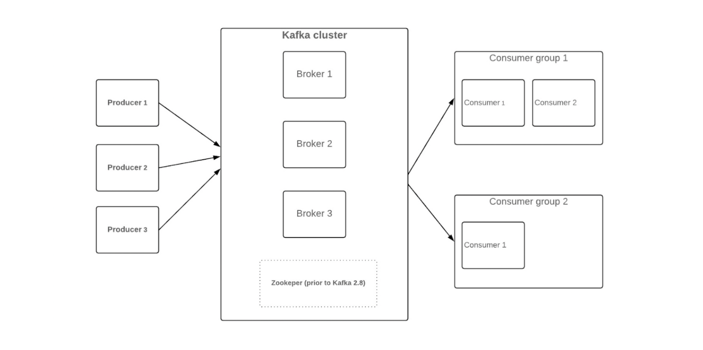
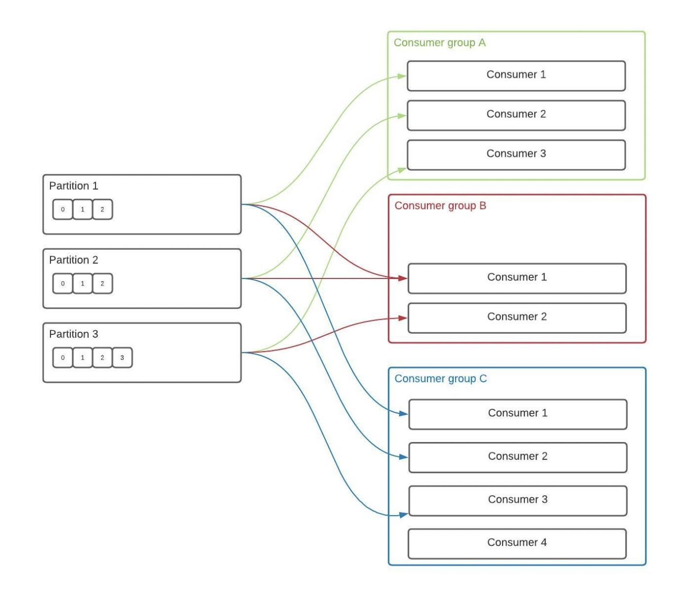

# Simple Kafka App (for learning purposes)

## What is Kafka?
Apache Kafka is an open-source distributed event store and stream processing platform.

**Distributed?** Components are spread across multiple computers (nodes). A partition is the unit of 
parallelism in Kafka, each partition holds some topic data independent of another and are spread across brokers

**Event store?** Applications persist events in an event store (database of events), it also works as a message 
broker and provides an API that enables services to subscribe to events, creating an [event-driven architecture](https://aws.amazon.com/event-driven-architecture/) 

**Streaming & stream processing?** Kafka is a stream processing platform; processes the transmission of a continuous 
flow of data (streams), it uses servers and clients that communicate over a high-performance TCP network protocol.

## Benefits of a message queue?
* Load-balancing (messages are divided over consumers).
* Availability (reading from the queue means even if the service fails, the request is read from the event source) 
* Heart-beating mechanism (check if a service is dead).
* Easier to scale (adding new listener services).

## When to use it?
* When the client services don't need to wait for a response from server services (Publish-Subscriber model).
* When you would benefit from load-balancing for requests. 
* When the request is general (send and forget). 

## When not to use (or Disadvantages)
* When consistency across services is important, and we need communication with downstream services.
* Difficulty with understanding the code-base's flow, the code ends with a hidden flow that prevents subscribers of 
the queue. 
* It would be difficult to migrate to request-response architecture. 

## Things to care about when using message queues like Kafka
* Idempotency might be required to be handled in code (if we should not execute twice for the same message in-case of 
  replies).
* Maintaining an events log for rollback situations.

## How it works?
A Kafka **Producer** sends a message (key/value pair) to a topic, by using a hashing function on the key of
the message to determine the **Broker**'s partition, each **Consumer** in a consumer group is subscribed to a subset 
of partitions of the topic. [further reading](https://softwaremill.com/what-problems-does-kafka-solve-in-distributed-systems/).
 
* **ProducerRecord**: record holding the message (fundamental unit of data in Kafka), it’s represented by a pair of 
  attributes: key and value. 
* **Producer**: pass messages to the topic. Once a message is processed and appended to the topic, it can’t be modified.
* **Broker**: it holds multiple partitions of various topics. Partitions are just parts of the topic that 
  store some portion of messages. Replication?
* **Consumer(s)**: are part of a consumer group, each can subscribe to more than one partition, but a single 
  partition is assigned to one consumer in each consumer group.

  

## Getting Started
* **Prerequisites**
  * Kafka download
  * pom.xml dependencies
    * org.apache.kafka
      * kafka-clients
    * org.slf4j
      * slf4j-simple
      * slf4j-api

* **Properties** 
  * bootstrap.servers
  * serialization
> NOTE: in the following commands, this format: `<thing1|thing2>` means that this is a placeholder and `thing1` is the 
> name of it, and `thing2` is the value I used for this particular sample app. 
* **Zookeeper** 
  * It is a centralized service for maintaining configuration information, naming, providing distributed 
    synchronization, and providing group services. These services are used in some form or another by distributed 
    applications like Kafka. [ref](https://zookeeper.apache.org/)
  * Zookeeper server must be running for Kafka's server bootstrapping. 
  * Start server: `bin/zookeeper-server-start.sh config/zookeeper.properties`
    * By default, it starts on port "2181".

* **Kafka Commands**
  * Start server: `bin/kafka-server-start.sh config/server.properties`
    * By default, it starts on port "9092".
  * Create topic: `./bin/kafka-topics.sh --create --bootstrap-server localhost:<port|9092> --replication-factor 
    <count|1> --partitions <count|1> --topic <topic-name|orders>`
  * List topics: `./bin/kafka-topics.sh --list`
  * Read messages for topic: `./bin/kafka-console-consumer.sh --bootstrap-server localhost:<port|9092> --topic <topic-name|orders> --from-beginning`